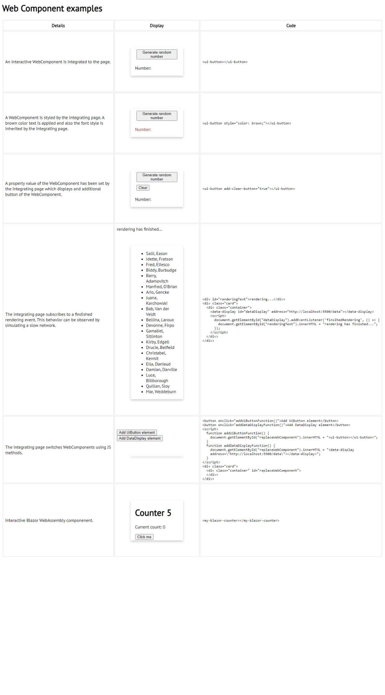

# WebComponents examples

## What is needed
```
dotnet 6 runtime
http-server npm package
```

## How to run
```
cd src\DataProviderService\
dotnet run
cd dist
http-server
go to http://127.0.0.1:8080/index.html
```

## How does it look like


## How does it work


## More info
https://indepth.dev/posts/1116/angular-web-components-a-complete-guide

https://learn.vonage.com/blog/2020/03/24/getting-started-with-web-components-dr/

https://angular.io/guide/elements

https://stackoverflow.com/questions/68180510/how-to-put-a-blazor-wasm-application-into-an-html-custom-element
