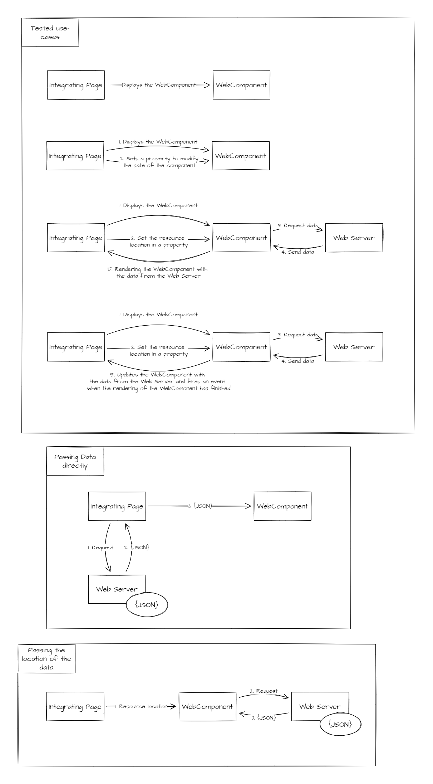

# WebComponents examples

## How to run
```
cd src\DataProviderService\
dotnet run //to run the backend service
cd ..
cd ..
cd dist
http-server // the files need to be hosted becasue of the Blazor example 
```



## More info
https://indepth.dev/posts/1116/angular-web-components-a-complete-guide

https://learn.vonage.com/blog/2020/03/24/getting-started-with-web-components-dr/

https://angular.io/guide/elements

https://stackoverflow.com/questions/68180510/how-to-put-a-blazor-wasm-application-into-an-html-custom-element
